## Safe-Space-Group-Project-Backend

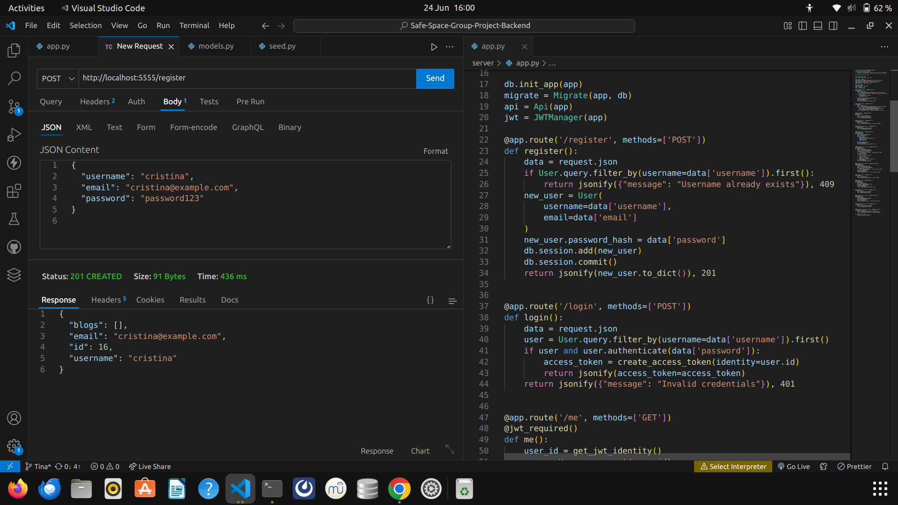 -- registering a new user

 -- login and get the JW token

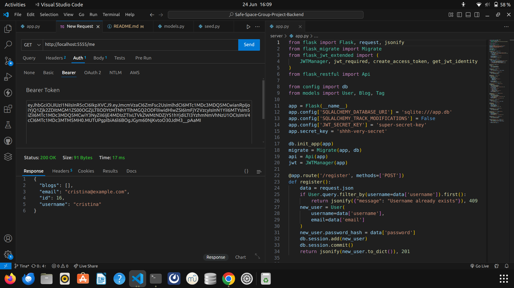 --- using the jw- token ... getting user's info 
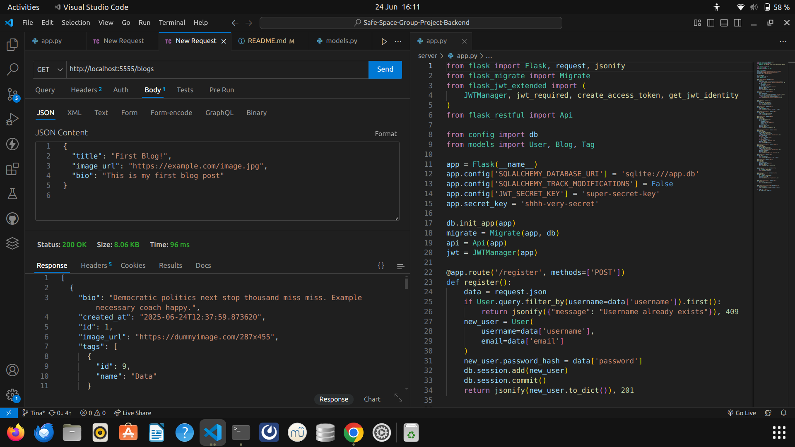 -- created a blog 

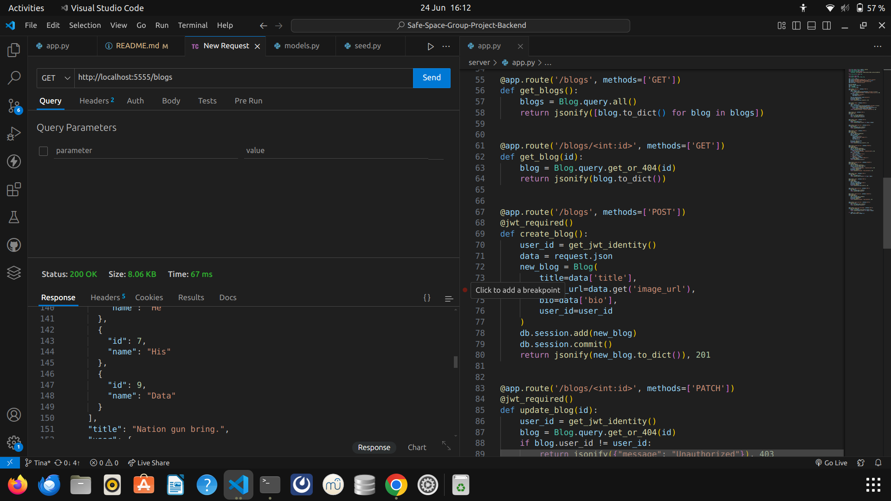 --- getting all blogs 

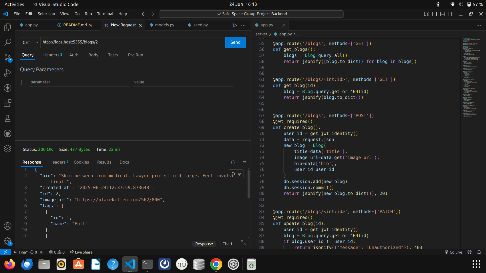 -- getting a single blog

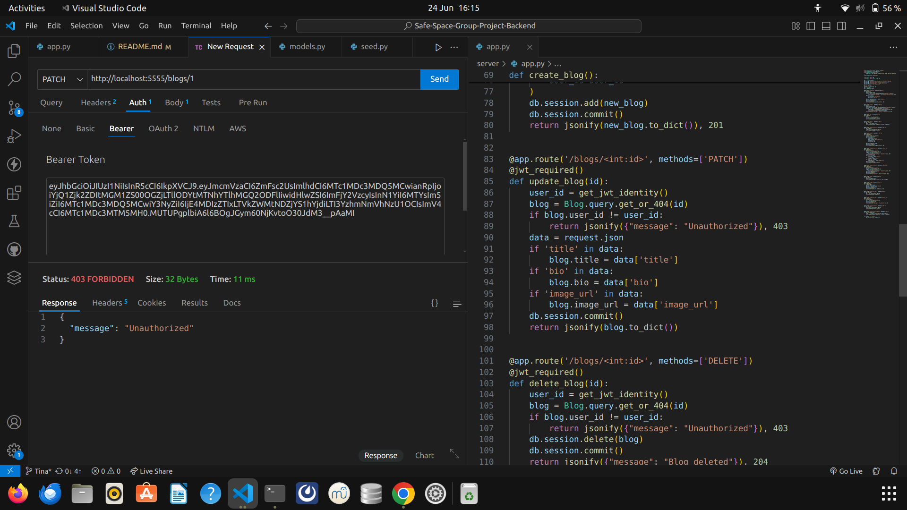 -- trying to update a blog usinga an expired token but getting an error "unauthorized"

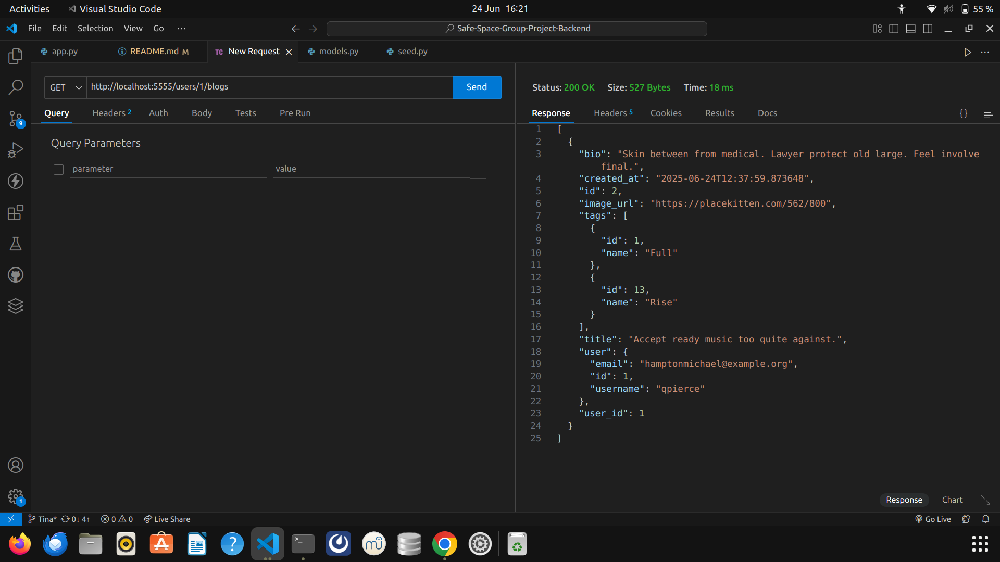 -- get users blogs

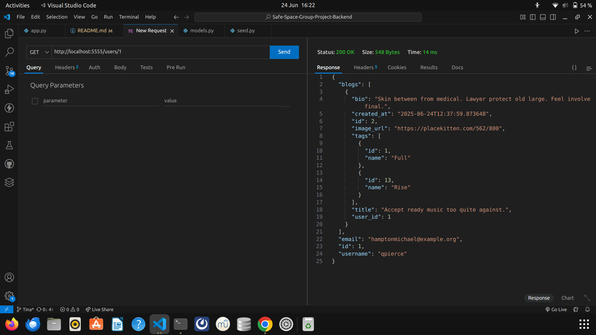 -- get users by id

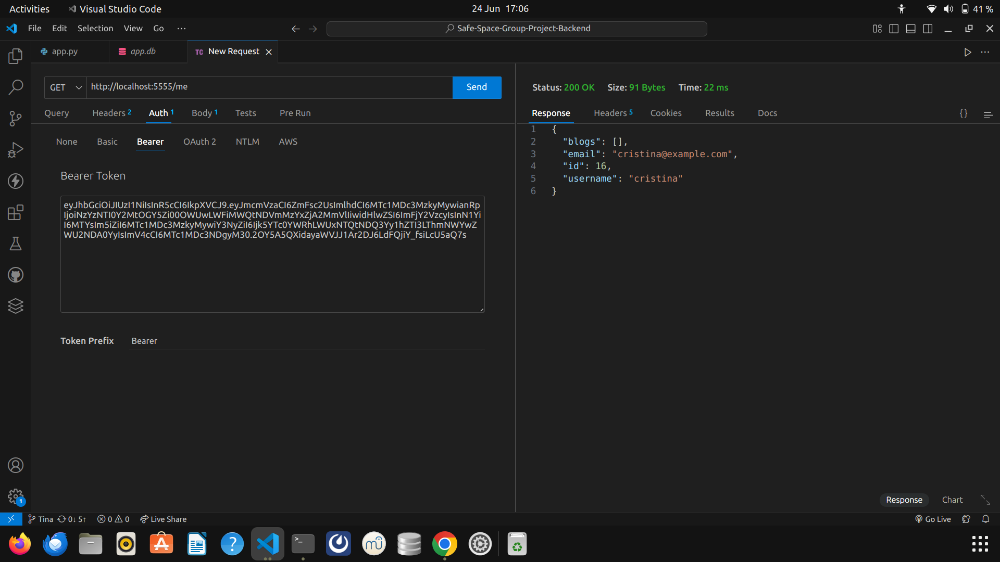 -- get my info 

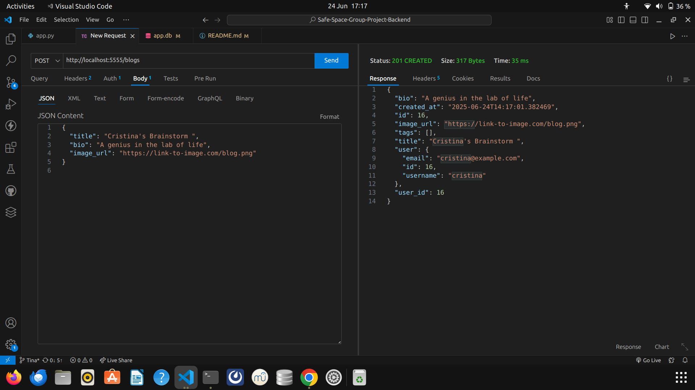 --- creating a blog for  a user 

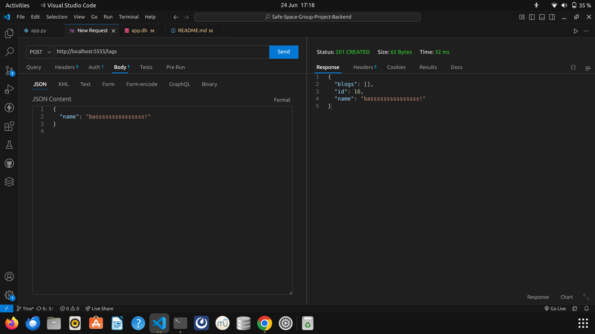 ---- creating tags for a logged in user

