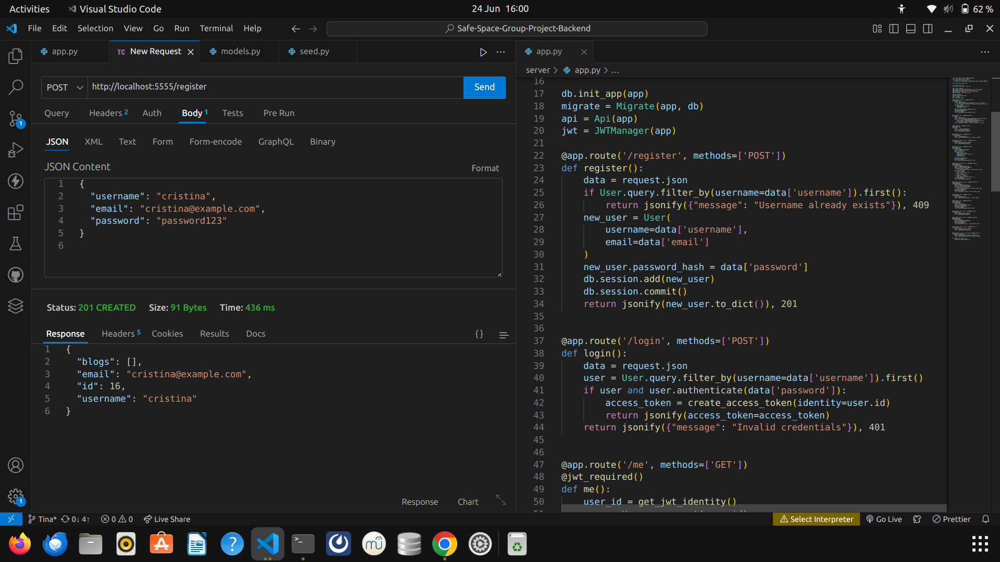
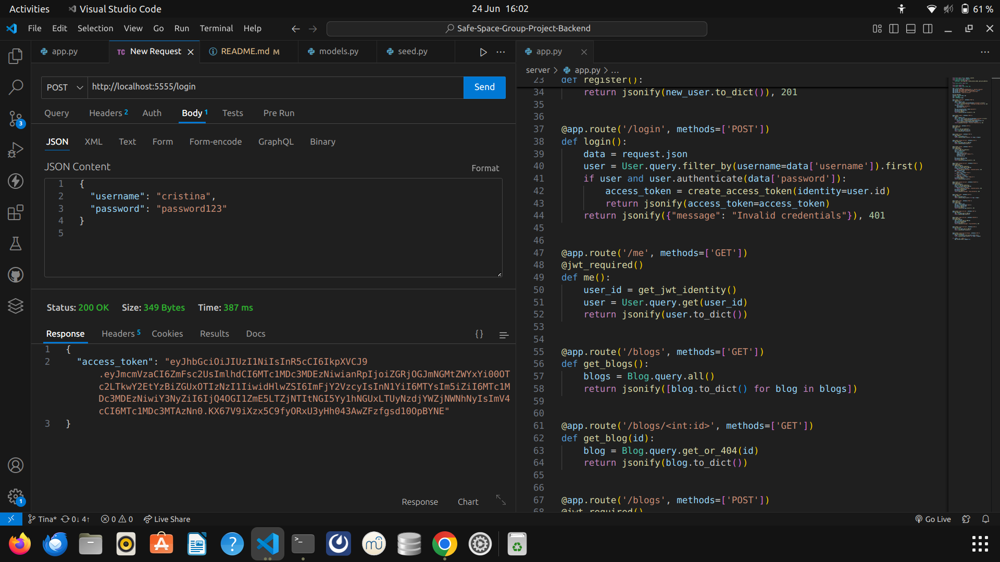
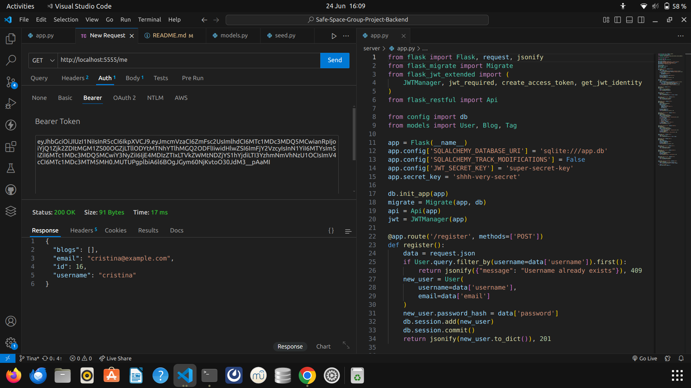
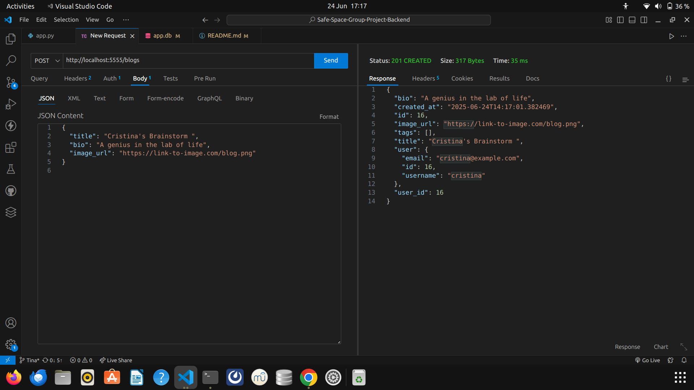
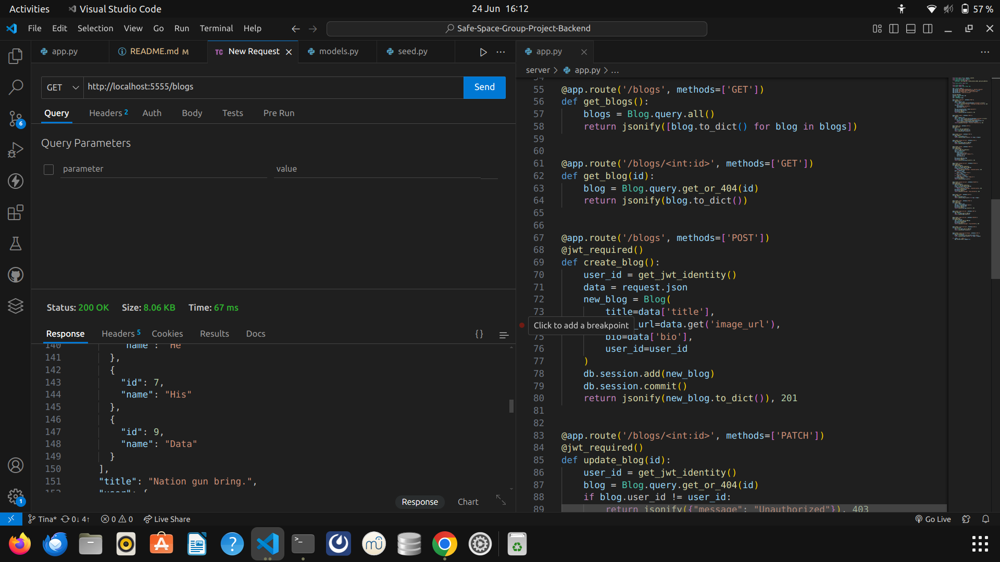
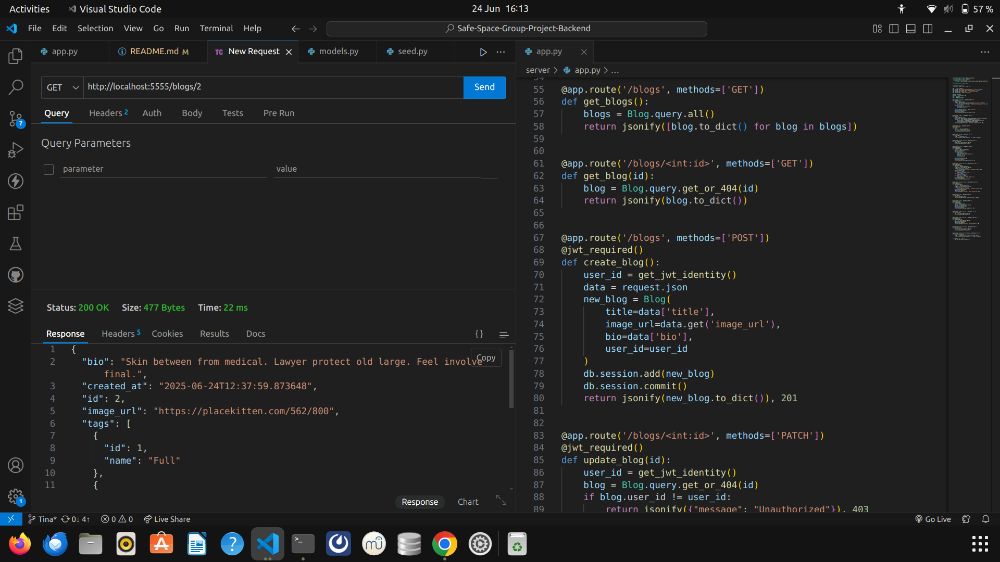
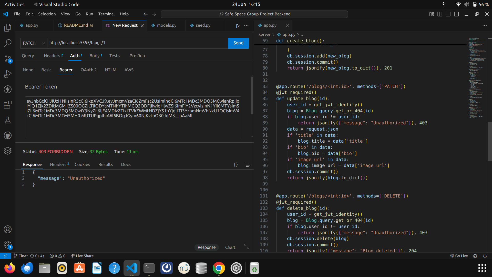
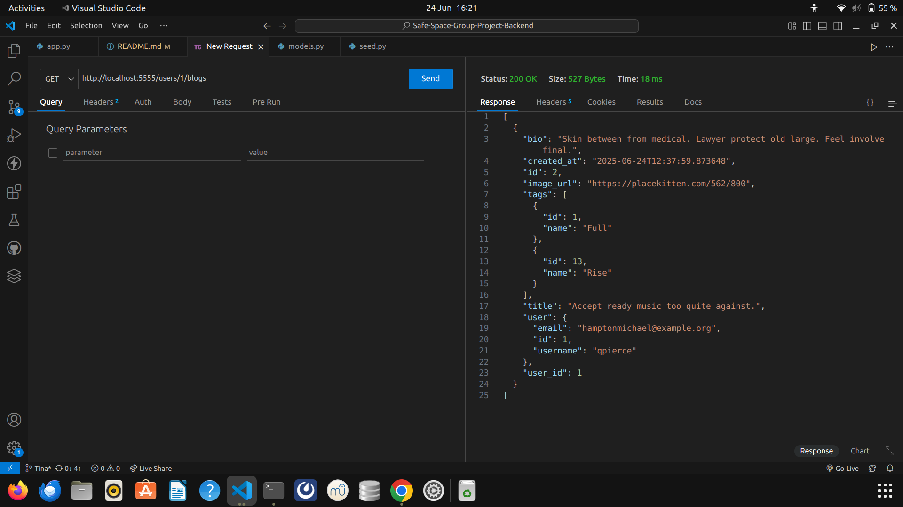
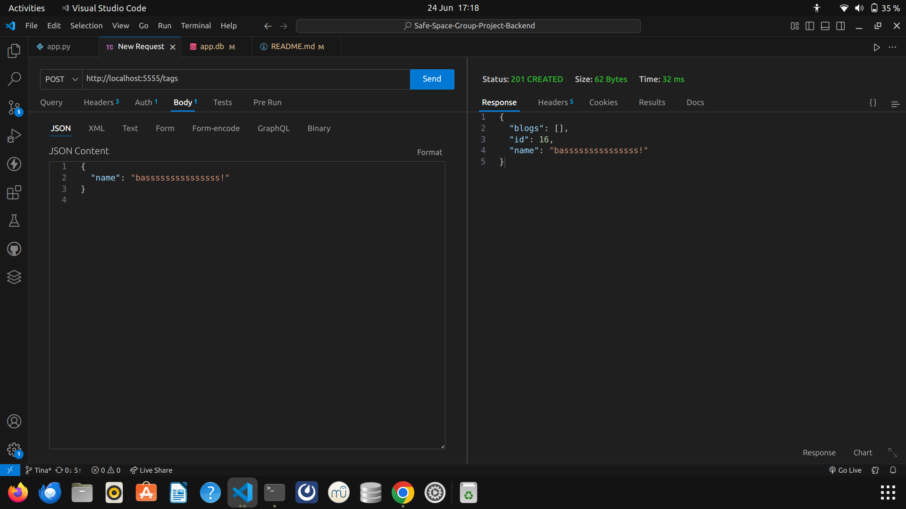

## Safe-Space-Group-Project-Backend


A **Flask REST API** 
for managing users, blogs , and tags 

## Setup

1. Clone the repository at:

   ```bash
   https://github.com/Jjumaaa/Safe-Space-Group-Project-Backend
   Then, cd Safe-Space-Group-Project-Backend
   ```
2. Install dependencies:

   ```bash
   pipenv install
   pipenv shell
   ```

## Environment Variables

Create a `.env` file:

```bash
FLASK_APP=app.py
FLASK_ENV=development
SECRET_KEY=super-secret-key
DATABASE_URL=sqlite:///app.db
```

## Dependencies

Install them with =pipenv "The dependency you want"

* flask
* flask-sqlalchemy
* flask-migrate
* flask-jwt-extended
* psycopg2-binary
* pipenv
* shell
* faker
* alembic
* flask-cors
* sqlalchemy
* serializer
* sqlalchemy-serializer
* flask-bcrypt
* flask-restful

## Database Migrations

```bash
alembic init alembic
alembic revision --autogenerate -m "created all tables"
alembic upgrade head
```

## Seeding the Database

```bash
python seed.py
```

## Run the Server

```bash
python app.py
```

## Authentication Flow

* **Register:** `POST /register`
* **Login:** `POST /login` (returns a JWT token)

Use the returned `token` in requests:

```
Authorization: Bearer <your_jwt_token_here>
```

## Available Routes
Here are the routes defined in your Flask app:

**User Authentication Routes:**

* `POST /register` – Register a new user.
* `POST /login` – Login a user and return a JWT.
* `GET /me` – Get the currently authenticated user's details.

**Blog Routes:**

* `GET /blogs` – Get all blogs.
* `GET /blogs/<int:id>` – Get a single blog by ID.
* `POST /blogs` – Create a new blog (requires authentication).
* `PATCH /blogs/<int:id>` – Update a blog by ID (requires authentication and ownership).
* `DELETE /blogs/<int:id>` – Delete a blog by ID (requires authentication and ownership).

**Tag Routes:**

* `GET /tags` – Get all tags.
* `POST /tags` – Create a new tag (requires authentication).
* `GET /tags/<int:id>` – Get a single tag by ID.
* `DELETE /tags/<int:id>` – Delete a tag by ID (requires authentication).

**User Info Routes:**

* `GET /users/<int:id>` – Get a user's information by ID.
* `GET /users/<int:id>/blogs` – Get all blogs created by a specific user.


## Thunderclient Guide!

Use Thunderclient to test endpoints 

## GitHub Repository

[https://github.com/Jjumaaa/Safe-Space-Group-Project-Backend](https://github.com/Jjumaaa/Safe-Space-Group-Project-Backend)


## registering a new user
 

## login and get the JW token

 

## using the jw- token ... getting user's info 

  

## created a blog 
 

## getting all blogs 

 

## getting a single blog
 

## trying to update a blog usinga an expired token but getting an error "unauthorized"



##  get users blogs by id 


##  creating tags for a logged in user
 

##  creating a new blog for a user
 


#### Github repository

##(https://github.com/Jjumaaa/Safe-Space-Group-Project-Backend)